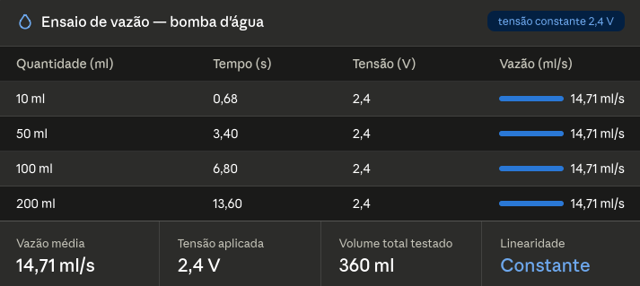

# 🚰 Precision Water Dispenser - IoT Edition

> **Projeto Integrador - Engenharia da Computação (UFSM)**

Sistema de controle e gestão de dispenser de precisão operando de forma autônoma. O projeto utiliza um **ESP32** atuando como Web Server embutido (Edge Computing), hospedando sua própria interface de usuário e controlando o hardware em tempo real sem a necessidade de um servidor back-end externo.

---

## Testes e Calibração da Bomba

Para garantir a precisão do dispenser, realizamos testes práticos variando a tensão e medindo o tempo de resposta da bomba. Os dados coletados de vazão, corrente e tempo estão consolidados na tabela abaixo:



> **Nota de Engenharia:** Com base nesses testes, optamos por fixar a operação na tensão mínima de **2.4V** utilizando um módulo conversor Buck. Nessa faixa, a vazão oferece a melhor resolução para a matemática de controle de tempo no nosso firmware C++, minimizando o erro por inércia do motor e evitando transbordamentos.

---

## 📋 Sobre o Projeto

Este projeto foi arquitetado com foco na estabilidade elétrica e independência de rede, características essenciais para sistemas embarcados em apresentação.

### Principais Funcionalidades
* **Web Server Embutido:** A interface (HTML/CSS/JS) é hospedada diretamente na memória Flash do ESP32 utilizando `PROGMEM`, garantindo baixa latência e dispensando hospedagem externa.
* **Cálculo Dinâmico de Vazão:** O usuário insere a quantidade em mililitros (ml) via interface Web, e o JavaScript realiza a conversão em tempo de acionamento do relé com base no fator de calibração prático.
* **Isolação de Domínios de Energia:** Arquitetura de hardware projetada para isolar a alimentação do microcontrolador (5V lógico) da alimentação de força motriz (Bateria/Pilhas reguladas via LM2596), prevenindo resets por *brownout* devido ao pico de partida do motor.

---

## 🛠️ Stack Tecnológica

### Software (Firmware e Interface)
* **Linguagem Principal:** C/C++ (Arduino Core para ESP32)
* **Bibliotecas:** `WiFi.h`, `WebServer.h`
* **Front-end:** HTML5, CSS3, Vanilla JavaScript (Embutidos no C++)

### Hardware
* **Microcontrolador:** ESP32 (DevKit V1 / WROOM-32)
* **Atuador:** Bomba de Água RS 385 (Diafragma)
* **Chaveamento:** Módulo Relé 5V (1 Canal)
* **Regulação de Força:** Módulo Step-Down LM2596
* **Alimentação:** Fonte USB 5V (ESP32) + Suporte Independente de 4 Pilhas AA / Bateria de Lítio (Bomba)

---

## 🔧 Como Executar (Setup)

### 1. Montagem do Hardware (Atenção à Isolação)
Para reproduzir o projeto sem travamentos, respeite a separação de energia:
1. Conecte o **ESP32** na tomada via cabo USB (Pino `VIN` e `GND` alimentam a lógica do Relé).
2. Conecte a fonte de baterias isolada na entrada (`IN+` / `IN-`) do **LM2596**. Regule a saída para **2.4V**.
3. Use o pino **COM** e **NO** do Relé para chavear apenas o polo positivo que sai do LM2596 para a Bomba de Água. O `GND` da saída do LM2596 vai direto para a bomba.
4. O pino de sinal (`IN`) do Relé vai ao pino Digital `D4` do ESP32.

### 2. Configuração do Firmware
1. Abra o arquivo `.ino` ou `main.cpp` na IDE (Arduino IDE / PlatformIO).
2. Localize as variáveis de rede e insira as credenciais de um **Hotspot Móvel (2.4 GHz)** para contornar bloqueios de redes institucionais corporativas:
   ```cpp
   const char* ssid = "NOME_DO_SEU_HOTSPOT";
   const char* password = "SENHA";
