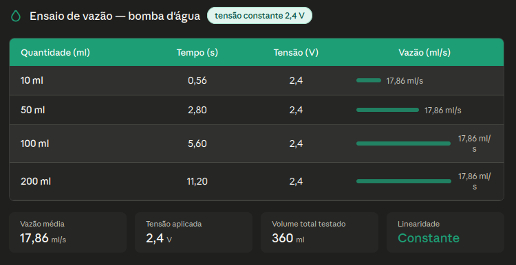

# 🚰 Precision Water Dispenser - IoT Edition

> **Projeto Integrador - Engenharia da Computação (UFSM)**

Sistema de controle e gestão de dispenser de precisão utilizando o ecossistema **Java/Spring** para a lógica de negócio e o **ESP32** como interface de hardware.

---
## Testes e Calibração da Bomba

Para garantir a precisão do dispenser, realizamos testes práticos variando a tensão e medindo o tempo de resposta da bomba. Os dados coletados de vazão, corrente e tempo estão consolidados na tabela abaixo:



> **Nota de Engenharia:** Com base nesses testes, optamos por fixar a operação na tensão mínima de **2.4V**. Nessa faixa, a vazão oferece a melhor resolução para o controle de tempo no nosso backend em Spring Boot, minimizando o erro por inércia e evitando transbordamentos.

---

## 📋 Sobre o Projeto

Este projeto evoluiu para uma arquitetura moderna de IoT, onde a robustez do **Spring Boot** é utilizada para gerir o fluxo de dados e regras de dosagem, enquanto o **ESP32** atua na ponta, executando os comandos de hardware.

### Principais Funcionalidades
* **Gestão via API:** Controlo de dosagem e monitorização através de endpoints REST.
* **Integração IoT:** Comunicação eficiente entre o microcontrolador e o servidor Java.
* **Escalabilidade:** Estrutura preparada para suportar múltiplos dispensers e persistência de dados.

---

## 🛠️ Stack Tecnológica

### Back-end (API)
* **Linguagem:** Java 17+
* **Framework:** Spring Boot 3
* **Segurança:** Spring Security (JWT opcional)
* **Persistência:** Spring Data JPA (Hibernate)

### Hardware
* **Microcontrolador:** ESP32
* **Comunicação:** Protocolo HTTP / MQTT

---

## 📂 Estrutura do Repositório

* `/api` - Código fonte do servidor Spring Boot.
* `/firmware` - Código do ESP32 para comunicação com o servidor.
* `/docs` - Documentação técnica e esquemas do projeto.

---

## 🔧 Como Executar

### 1. Servidor (Back-end)
```bash
cd api
./mvnw spring-boot:run
